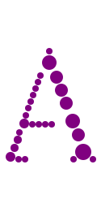

# The Fractabubbler

This program is created to generate fonts that can be easiliy
rendered using [Bubbl](https://github.com/ruuzia/bubbl) objects.

The fractabubbler takes in a ttf font and a particular glyph and spits out
an svg-conforming file containing only circles. This arrangement of
circles of various sizes is designed to mimic the form of the glyph.

## How does it work?

The mechanism and design of the fractabubbler is inspired by fractals such as
the [Apollonian Gasket](https://en.wikipedia.org/wiki/Apollonian_gasket).

It repeatedly finds the largest circle which can fit within the available space.
Computing this position based on the joined Bezier curve segments which a font
consists of appears mathematically terrifying. Instead I cheat by rasterizing
the glyphs and performing a quadratic search through the bitmap repeatedly.
